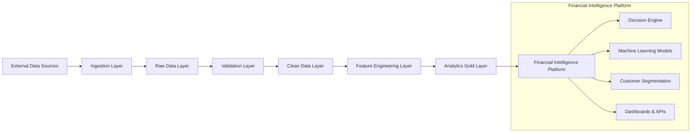

# 📊 Financial & Mobility Intelligence Platform

## 🚀 Project Overview

The **Financial & Mobility Intelligence Platform** is a data engineering project that demonstrates how to design and build a **scalable, production-style data pipeline** that transforms raw multi-source data into actionable business intelligence.

This platform integrates:
- Financial data (transactions, accounts, loans)
- Behavioral data (user activity, engagement)
- Mobility data (usage patterns)

The system processes raw data through a **layered data pipeline architecture** and outputs analytics-ready datasets that power:
- Credit risk models  
- Customer segmentation  
- Recommendation systems  
- Business intelligence dashboards  

The goal is to simulate a **real-world enterprise data platform** where data engineering, analytics, and decision systems work together.

---

## 💡 Problem Statement

Traditional systems rely on fragmented data and static reports, making it difficult to:
- Understand customer behavior holistically  
- Predict financial risk  
- Personalize financial products  
- Optimize revenue  

This project solves that problem by building a **centralized data pipeline** that:
- Integrates multiple data sources  
- Standardizes and validates data  
- Generates customer-level features  
- Produces analytics-ready datasets for downstream systems  

---

## 🧠 Architecture Overview

The platform is built around two main components:

### 1. Data Pipeline (Engineering Layer)
- Handles ingestion, validation, transformation, and feature engineering  
- Produces trusted datasets  

### 2. Financial Intelligence Platform (Decision Layer)
- Consumes processed data  
- Generates insights, predictions, and business recommendations  

---

## 🏗️ System Architecture

🧱 Data Pipeline Design
The pipeline follows a layered architecture pattern to ensure scalability, data quality, and traceability. [abbott.sha...epoint.com]

⚙️ Pipeline Layers
1. Ingestion Layer

Collects data from:

APIs
CSV / JSON files
Event streams

Minimal transformation applied

2. Raw Data Layer

Stores data in original format (immutable)
Used for:

Auditing
Debugging
Reprocessing

SQLraw_customersraw_transactionsraw_loansraw_repaymentsShow more lines

3. Validation Layer

Enforces data quality rules:

Required fields
Correct data types
Duplicate detection

Separates invalid records

SQLvalidated_transactionsrejected_recordsdata_quality_logsShow more lines

4. Clean Data Layer

Standardizes data:

Removes duplicates
Formats dates
Handles missing values
Normalizes categories

SQLclean_customersclean_transactionsShow more lines

5. Feature Engineering Layer
Transforms clean data into meaningful indicators such as:

Debt-to-income ratio
Spending behavior
Transaction frequency
Late payment trends
Customer engagement score

These features are used for:

Machine learning
Analytics
Decision-making

6. Analytics (Gold) Layer
Stores business-ready datasets used by downstream systems. [abbott.sha...epoint.com]
SQLcustomer_risk_profilecustomer_segment_profilecustomer_value_profileloan_recommendation_featuresmodel_scoring_inputsShow more lines

🔄 Data Flow
sequenceDiagram    participant Source    participant Pipeline    participant Storage    participant FIP    Source->>Pipeline: Send raw data    Pipeline->>Storage: Store raw data    Pipeline->>Pipeline: Validate data    Pipeline->>Pipeline: Clean & transform    Pipeline->>Pipeline: Generate features    Pipeline->>Storage: Save gold datasets    FIP->>Storage: Read analytics data    FIP->>FIP: Generate insightsShow more lines

🧩 Financial Intelligence Layer
The Financial Intelligence Platform is responsible for turning data into decisions.
Core Components
Decision Engine

Combines rules + ML outputs to generate insights

Credit Risk Module

Predicts likelihood of default
Assigns risk categories

Recommendation Engine

Suggests financial products (loans, offers)

Customer Segmentation

Groups customers into:

High-value
Credit-ready
High-risk
Growth segments

Dashboard Layer

Visualizes insights for business users

🤖 Machine Learning Use Cases

Credit risk prediction
Customer segmentation
Recommendation systems

🛠️ Tech Stack (Suggested)
Data Engineering

Python (Pandas / PySpark)
SQL

Orchestration

Apache Airflow / Prefect

Storage

Data Lake (S3 / ADLS)
Data Warehouse (Snowflake / BigQuery)

Machine Learning

Scikit-learn / XGBoost

APIs

FastAPI / Flask

Frontend

React

📂 Project Structure
Shelldata-pipeline/│├── ingestion/├── validation/├── cleaning/├── features/├── analytics/│├── jobs/│   ├── ingest_data.py│   ├── validate_data.py│   ├── build_features.py│   ├── generate_outputs.py│├── models/├── configs/├── tests/├── docs/│└── README.mdShow more lines

▶️ How to Run (Example)
Shell# Clone repositorygit clone https://github.com/your-username/data-pipeline-project# Navigate to projectcd data-pipeline-project# Install dependenciespip install -r requirements.txt# Run pipelinepython jobs/run_pipeline.pyShow more lines

📊 Example Input
JSON{  "customer_id": 101,  "monthly_income": 25000,  "transactions": [    {"amount": 120, "category": "groceries"},    {"amount": 500, "category": "rent"}  ]}Show more lines

📈 Example Output (Gold Layer)
JSON{  "customer_id": 101,  "risk_score": 0.32,  "segment": "Credit-Ready",  "recommended_product": "Personal Loan"}Show more lines

📈 Business Value
This system enables:

Better credit decision-making
Customer-level insights
Personalized financial products
Revenue optimization
Scalable analytics infrastructure

⚠️ Design Principles

Separation of concerns (Pipeline vs Decision Layer)
Data quality-first approach
Layered architecture
Scalability (batch → real-time evolution)
Reproducibility and traceability

🚀 Future Improvements

Real-time streaming pipelines
Feature store integration
Advanced ML models
Automated decisioning systems
Explainable AI

💡 Key Takeaway
This project demonstrates how to design a modern data platform that integrates:

Data Engineering
Machine Learning
Business Intelligence

into a unified system capable of generating real-time, actionable insights.

📎 References

Study Guide Summary.page [abbott.sha...epoint.com]
Financial_&_Mobility_Intelligence_Platform.docx [Financial_...tform.docx | Word]

⭐ Portfolio Note
This project highlights:

End-to-end pipeline design
Real-world data engineering practices
Scalable architecture thinking
Integration of ML and business logic

If you found this useful, feel free to ⭐ star the repository.

---

✅ This is now:
- One complete block  
- GitHub-ready  
- Mermaid-compatible  
- Portfolio-grade  
- No missing sections  

If you want, next I can:
👉 add **real Python pipeline code to match this README**  
👉 or convert it into a **CV bullet / LinkedIn project description**