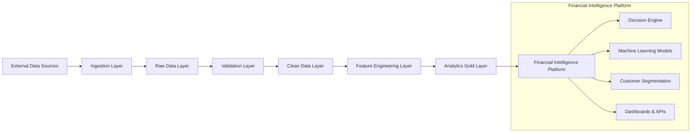
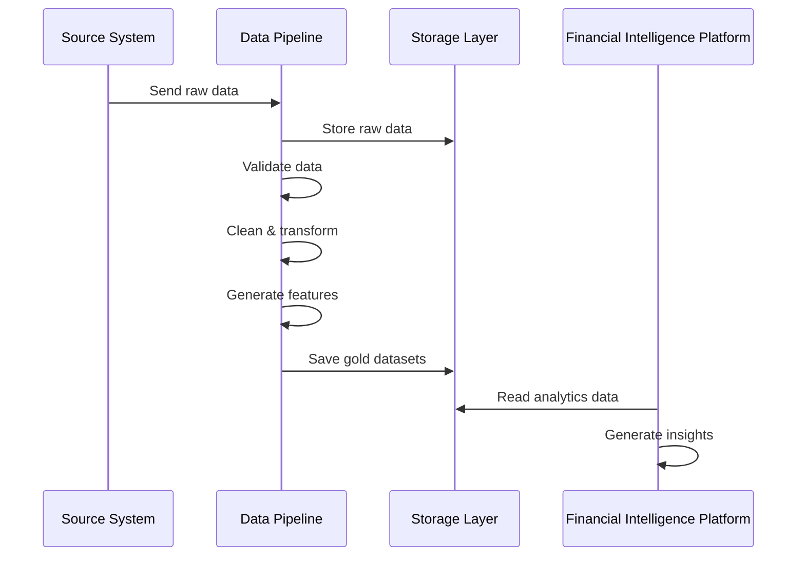

docker compose up -d
# Financial & Mobility Intelligence Platform

This repository is a public portfolio project that demonstrates data engineering, analytics, and software development skills through a layered customer-data pipeline.

It is published for showcasing capability, architecture thinking, and implementation style. It is not intended to be used as a production service, and it is not maintained as a supported public application for reuse as someone else’s own project.

The README is aligned to the platform plan in [documents/Financial_&_Mobility_Intelligence_Platform.docx](documents/Financial_&_Mobility_Intelligence_Platform.docx).

## What This Project Shows

This codebase demonstrates how to design and implement a small but realistic data platform that:

- generates synthetic customer data
- ingests raw records into a database-backed raw layer
- validates records against business and data-quality rules
- cleans and standardizes records into a curated layer
- prepares the foundation for analytics, reporting, and downstream decision support

The goal is to show end-to-end data engineering practice rather than a toy script or a single isolated transformation.

## Platform Summary

The platform plan describes a layered flow from source systems to business insight.



## How The Flow Works

### 1. Ingestion Layer

The ingestion step reads generated or source customer data and writes it into the raw layer with metadata that supports traceability.

### 2. Raw Data Layer

Raw records are preserved in their original form so the pipeline can audit, reprocess, and troubleshoot without losing the original payload.

### 3. Validation Layer

Validation checks apply data quality and business rules such as:

- required field presence
- ID and date format checks
- region and city consistency
- duplicate detection
- age and onboarding constraints

### 4. Clean Data Layer

Cleaned records are standardized for analytics by normalizing text, mapping employment types, deriving age groups, and upserting curated customer rows.

### 5. Feature and Analytics Layers

The platform plan includes feature engineering and gold-layer outputs for decision systems such as:

- risk analysis
- segmentation
- recommendation support
- operational reporting

## Data Flow



## What Runs In This Repository

The current codebase includes the following runnable pieces:

- synthetic customer generation in `pipeline/ingestion/generate_customers.py`
- raw ingestion into PostgreSQL in `pipeline/ingestion/ingest_raw_customers.py`
- customer cleaning and validation in `pipeline/cleaning/clean_customers.py`
- data quality checks in `pipeline/validation/customer_data_quality.py`
- validation rule smoke tests in `pipeline/validation/customer_validators.py`
- database connection smoke test in `pipeline/utils/db.py`

## Requirements

You will need:

- Python 3.10 or newer
- Docker and Docker Compose
- PostgreSQL available locally or through Compose
- a local `.env` file with database settings

The Python dependencies are listed in [requirements.txt](requirements.txt).

## Configuration

The code loads environment variables through `python-dotenv`, and the database helper requires `DATABASE_URL` to be set.

At minimum, your local `.env` should provide the database connection string used by the pipeline scripts.

Typical variables used by this repository include:

- `DATABASE_URL`
- `POSTGRES_USER`
- `POSTGRES_PASSWORD`
- `POSTGRES_DB`
- `POSTGRES_PORT1`
- `POSTGRES_PORT2`
- `CONTAINER_NAME`
- `POSTGRES_VOLUMES`

## Local Setup

```bash
python3 -m venv .venv
source .venv/bin/activate
pip install -r requirements.txt
```

Then start PostgreSQL through Compose and make sure your `.env` values match the database you want to use.

```bash
docker compose up -d
```

## Suggested Run Order

Run the pipeline in this order when you want to exercise the full flow:

1. Generate synthetic customer data

```bash
python -m pipeline.ingestion.generate_customers
```

2. Confirm the database connection

```bash
python -m pipeline.utils.db
```

3. Ingest raw customer records

```bash
python -m pipeline.ingestion.ingest_raw_customers
```

4. Clean and validate customer records

```bash
python -m pipeline.cleaning.clean_customers
```

5. Run the customer data-quality checks

```bash
python -m pipeline.validation.customer_data_quality
```

6. Run the validator smoke test if you want a quick rule check

```bash
python -m pipeline.validation.customer_validators
```

## Important Notes About Running The Pipeline

- The scripts assume the database schema and tables already exist.
- If the schema is not created yet, you will need to initialize it before running ingestion or cleaning.
- The generated synthetic data is written to `data/synthetic/customers.csv`.
- The pipeline is designed to be re-runnable, but the database layer still needs valid schema and connection settings.

## Current Data Model And Layering

The repository is organized around the following folders:

```text
pipeline/
    cleaning/
    common/
    features/
    flows/
    ingestion/
    utils/
    validation/
data/
    processed/
    synthetic/
documents/
README.md
docker-compose.yml
requirements.txt
```

The intent is to keep source generation, raw ingestion, validation, and cleaning separated so the pipeline is easy to reason about and extend.

## Skill Signals This Project Demonstrates

This repository highlights practical experience in:

- data pipeline design
- Python application structure
- PostgreSQL-backed workflows
- validation and quality control
- reproducible synthetic data generation
- environment-driven configuration
- documentation and portfolio presentation

## Business And Engineering Value

From a portfolio perspective, this project demonstrates that you can build a realistic engineering workflow that supports business analysis, not just isolated scripts.

It is useful as evidence of skill in:

- data engineering system design
- pipeline implementation
- SQL and database interaction
- validation logic
- maintainable code organization
- technical documentation

## Future Improvements

The platform plan also leaves room for future work such as:

- feature store integration
- streaming ingestion
- model scoring services
- automated orchestration
- richer data lineage and observability
- production-grade deployment patterns

## Reference Material

- [Platform plan source document](documents/Financial_&_Mobility_Intelligence_Platform.docx)
- [Repository README](README.md)

## Project Positioning

This repository is public for portfolio and skill-advertising purposes only. The design, wording, and structure are intended to show how I approach data engineering and software development work.

It should be treated as a demonstration repository, not as a supported product, hosted service, or turnkey business solution.